<h1 align=center>SD701 - Rapport de projet : prédiction du niveau de pollution dans le métro parisien</h1>

<h2>Table des matières</h2>

<ol>
    <li><a href="#ref1">Présentation du projet</a></li>
    <li><a href="#ref2">Collecte des données</a></li>
    <li><a href="#ref3">Nettoyage du jeu de données "qualité de l'air en station" et premières analyses</a></li>
    <li><a href="#ref4">Nettoyage des autres jeux de données</a></li>
    <li><a href="#ref5">Etudes de corrélations</a></li>
    <li><a href="#ref6">Conclusion</a></li>
</ol>

<h1 id="ref1">1. Présentation du projet</h1>

Le but de ce projet est d'évaluer la possibilité de conduire une analyse prédictive du niveau de pollution à la station de métro Franklin Roosevelt en fonction de divers paramètres. 
Le présent rapport est un condensé des résultats obtenus. Le code complet des différentes parties est disponible sur Github : <mark>LIEN</mark>  
Pour mener à bien cette étude, les données ci-dessous ont été collectées. Deux niveaux de précision sont disponibles : heure par heure (h) ou bien par tranche horaire par jour-type par semestre (th/jt/s). Par exemple : de 7h30 à 9h30, le samedi, au premier semestre 2021.
- [Qualité de l'air à la station Franklin Roosevelt sur la ligne 1 (2013-2021) (h)](https://dataratp.opendatasoft.com/explore/dataset/qualite-de-lair-mesuree-dans-la-station-franklin-d-roosevelt) (*)
- [Qualité de l'air extérieur (2017-2021) (h)](https://data-airparif-asso.opendata.arcgis.com)
- [Données météo (2013-2021) (h)](https://www.infoclimat.fr/observations-meteo/temps-reel/paris-montsouris/07156.html)
- [Validation aux bornes, représentant l'affluence en station (2015-2021) (th/jt/s)](https://data.iledefrance-mobilites.fr/explore/dataset/validations-sur-le-reseau-ferre-profils-horaires-par-jour-type-1er-sem/information/)
- [Trafic ferroviaire, déterminé à partir des fréquences de passage des trains (S2 2021) (th/jt/s)](https://www.ratp.fr)

<i>(*) Les données de 2 autres stations - Châtelet (ligne 4) et Auber (ligne A) - ont aussi été étudiées dans un premier temps puis écartées par la suite par manque de données.</i>

<h1 id="ref2">2. Collecte des donnnées</h1>

- Les données de qualité de l'air en station et de validation aux bornes sont directement disponibles au format CSV. 
- Il n'existe a priori pas d'historique du trafic ferroviaire. Les données de mesure du trafic sont celles ayant cours au 2ème semestre 2021. 
- Les historiques météo et de qualité de l'air extérieur ne sont pas directement accessibles, ce qui a nécessité un scrapping des données. Il s'agit de l'objet de cette partie.  
- <mark>Données météo : ramener le dossier de Pakwette dans "Données brutes" et préciser qu'elles ont été mises sur MySQL</mark>
- <mark>Données qualité de l'air extérieur : ramener le dossier de Sara dans "Données brutes"</mark>
- <mark>Mettre des screenshots des sites/du code/des résultats</mark>

<h1 id="ref3">3. Nettoyage du jeu de données "qualité de l'air en station" et premières analyses</h1>

### &nbsp;&nbsp;&nbsp; **3.1. Présentation des features**

Les données étudiées sont issues de l'API RATP.  
Elles contiennent les mesures moyennes heure par heure des indicateurs suivants :
- Paramètres climatiques usuels : température en °C et taux d'humidité en %
- Indicateur de concentration de CO2 dans l'air en ppm
- Indicateurs de la qualité de l'air : NO, NO2, PM10 et PM25 en µg/m3

La collecte de ces mesures a commencé en 2013. Au total, le jeu de données contient donc quelques 1 350 000 valeurs (450 000 par station).

### &nbsp;&nbsp;&nbsp; **3.2. Qualité du jeu de données**

Avant d'amorcer l'exploitation du jeu de données à proprement parler, il est nécessaire d'estimer sa qualité, à savoir principalement le nombre de valeurs exploitables par station.

  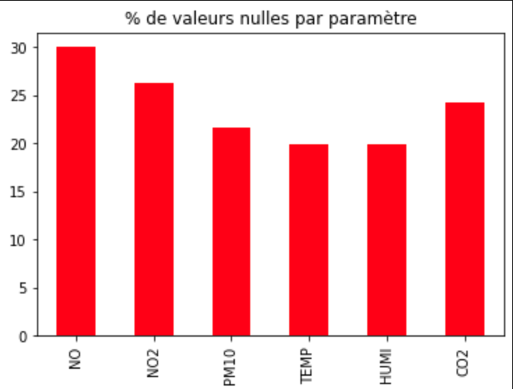
  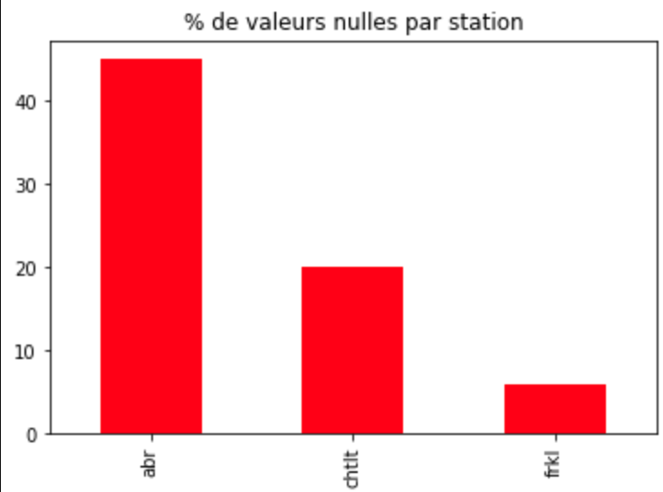 
  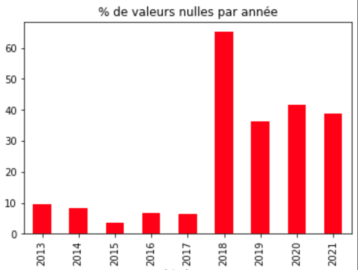

  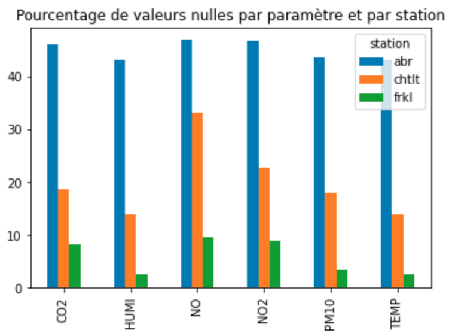
  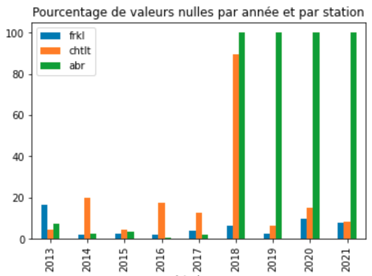

- 40% des valeurs à disposition pour la station Auber sont des valeurs nulles : il semblerait qu'à partir de 2018, les capteurs de cette station aient cessé de fonctionner.
- Plus de 90% des mesures de la station Châtelet sur l'année 2018 sont inexploitables. Sur les autres années, cette station ne présente pas plus de 20% de valeurs nulles.
- Il n'y a pas de dissymétrie au niveau du nombre de valeurs nulles par paramètre : autrement dit, on dispose d'un nombre globalement identique de valeurs exploitables pour chaque paramètre.

### &nbsp;&nbsp;&nbsp; **3.3. Comparaison des qualités de l'air moyennes dans les 3 stations**

Valeurs moyennes des paramètres sur l'ensemble du jeu de données :

	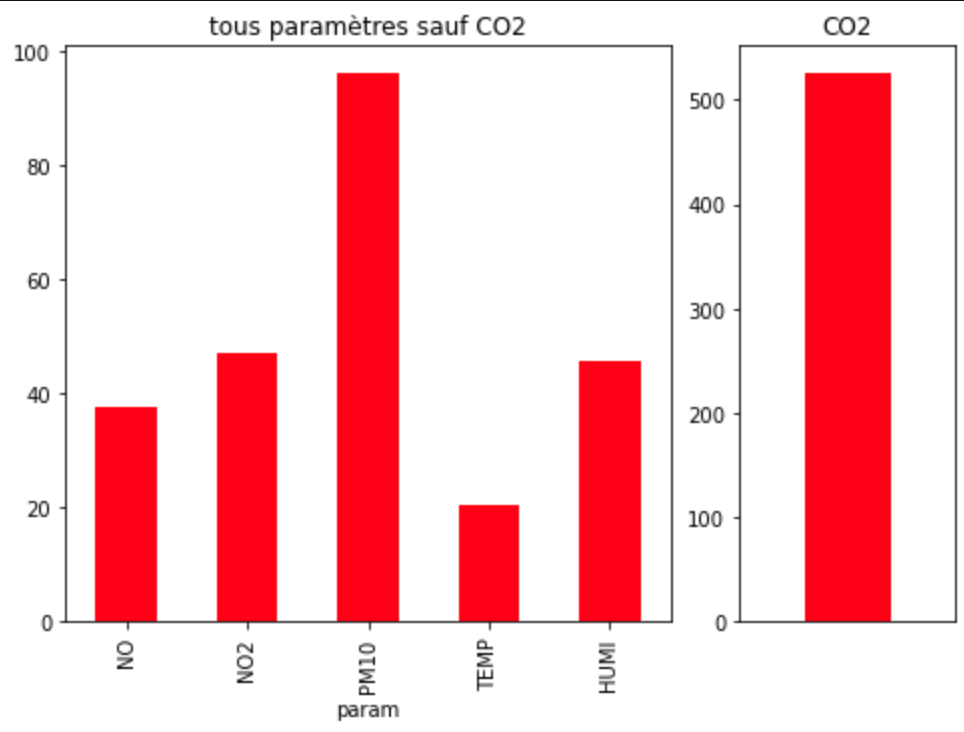
	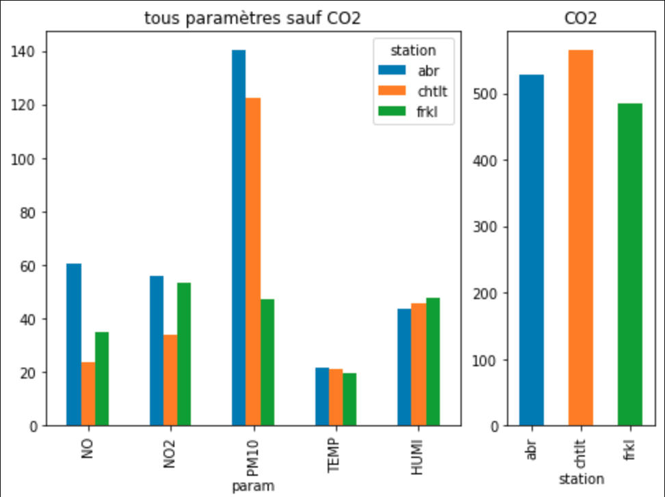

- La station Châtelet semble moins exposée au NO et au NO2 que les stations Auber et Franklin Roosevelt.
- La station Franklin Roosevelt est moins exposée au PM10 que Auber et Chatelet.
- Les paramètres de température, d'humidité ainsi que la concentration en CO2 sont très proches sur les 3 stations.

### &nbsp;&nbsp;&nbsp; **3.4. Patterns d'évolution temporelle des indicateurs de qualité de l'air**

Courbes d'évolution moyennées sur l'ensemble des valeurs pour les 3 stations sur différentes échelles de temps.
Dans l'ordre : 
- Heure par heure jours ouvrés
- Heure par heure weekends
- Jour de la semaine
- Mois de l'année
- Années depuis 2013

L'objectif ici étant d'afficher l'évolution des paramètres indépendemment de leur valeur intrinsèque, les valeurs sont divisées par la moyenne, ce qui donne des courbes sans unité oscillant autour de 1.

	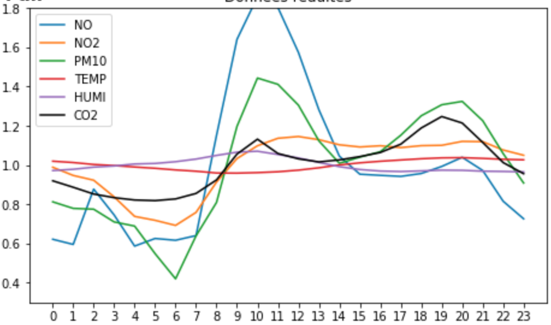
	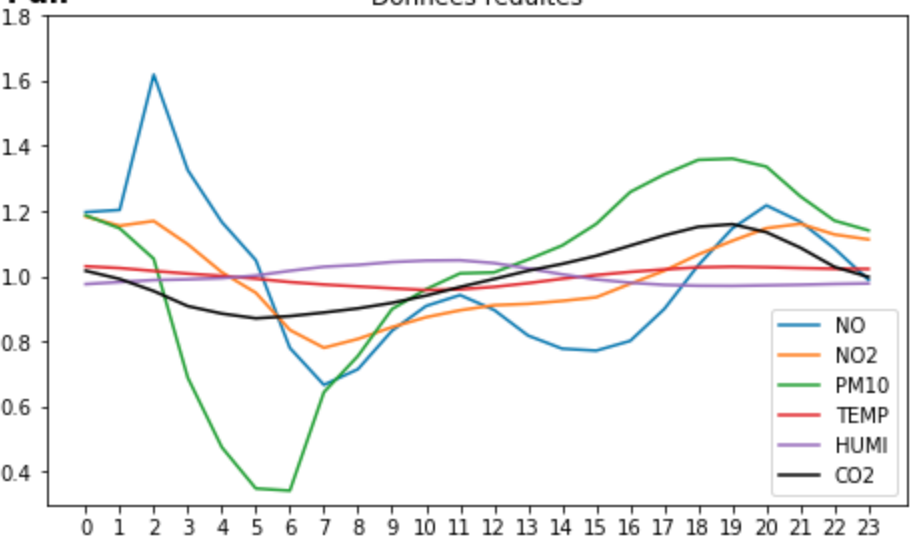
	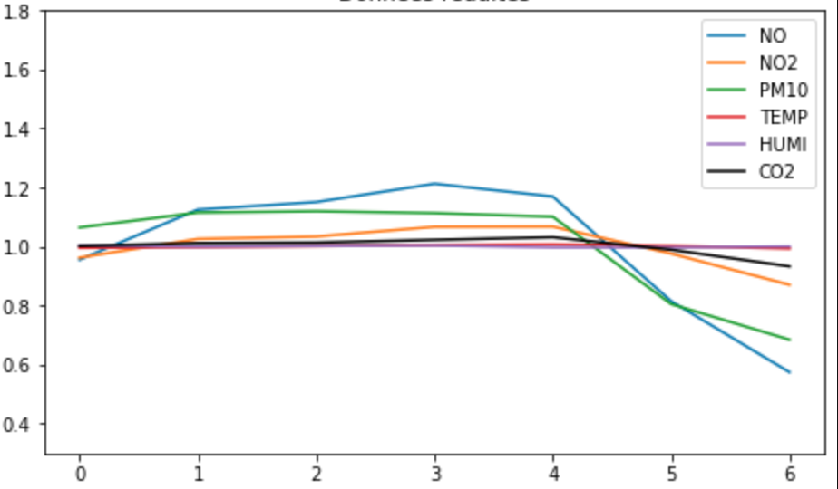

	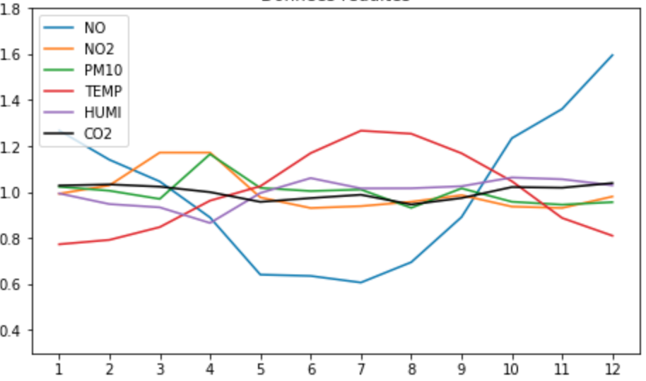
	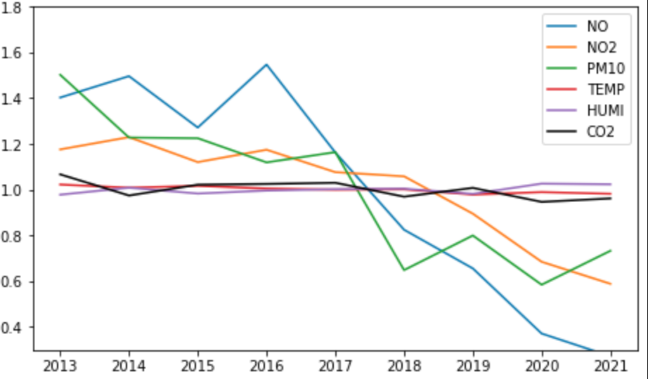
	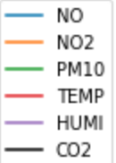

#### &nbsp;&nbsp;&nbsp;&nbsp;&nbsp;&nbsp; **Variations à court terme : au cours d'une même journée et au cours de la semaine**
- TEMP et HUMI : pas ou peu de variations
- CO2 et NO2 : variations non négligeables  (de l'ordre de 10-20%)
- NO et PM10 : variations significatives (de l'ordre de 40-50%)

#### &nbsp;&nbsp;&nbsp;&nbsp;&nbsp;&nbsp; **Variations à moyen terme : au cours de l'année**
- CO2, NO2 HUMI et PM10 : pas ou peu de variations
- TEMP : variations saisonnières non négligeables (de l'ordre de 20%)
- NO : variations saisonnières significatives (de l'ordre de 40%)

#### &nbsp;&nbsp;&nbsp;&nbsp;&nbsp;&nbsp; **Variations à long terme : au fil des ans**
- TEMP, HUMI, CO2 : pas ou peu de variations
- PM10, NO et NO2 : tendance baissière au fil des ans

Les courbes ci-dessus laissent appraître, en moyenne sur les 3 stations, des cycles d'évolution des paramètres de qualité de l'air sur différentes échelles de temps.  
Il peut être intéressant de vérifier si chacune des stations individuellement suit les mêmes patterns d'évolution. Les graphes ci-dessous représentent la comparaison des évolutions du paramètre NO sur les 3 stations (même échelle de temps que les graphes ci-dessus).

	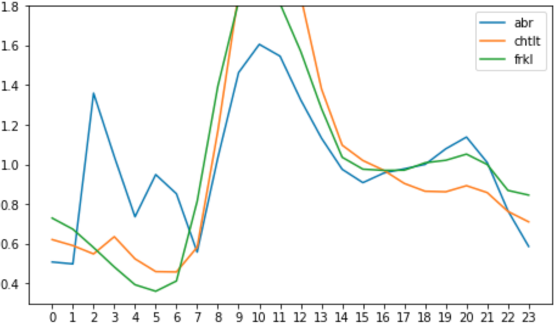
	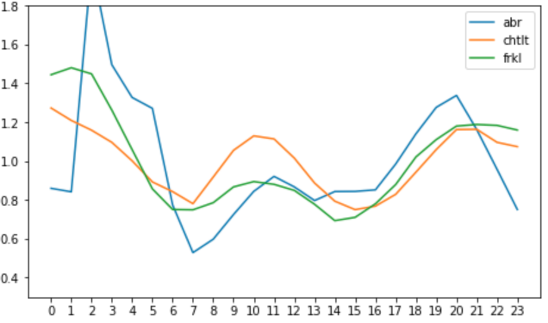
	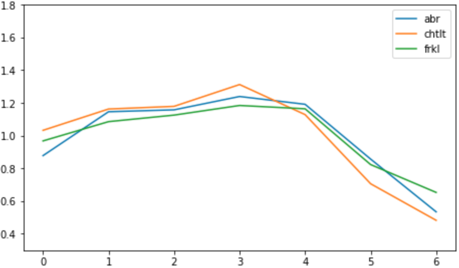

	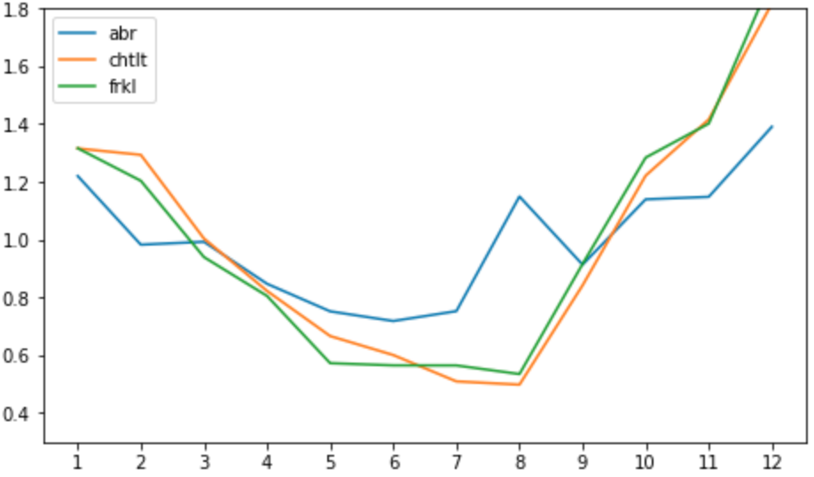
	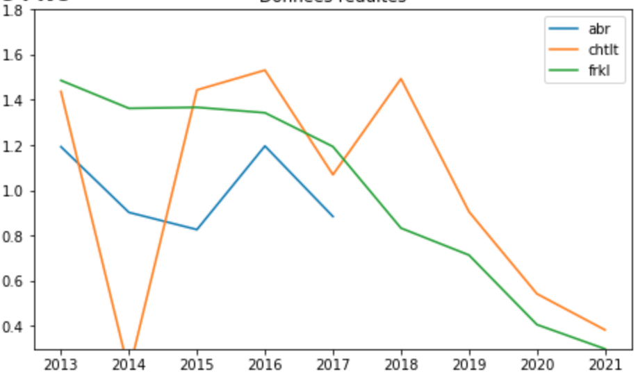
	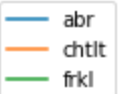

En dehors des variations années après annnées qui présentent certaines incohérences, on remarque que toutes les variations listées dans la partie précédente sont bien communes aux 3 stations et relèvent donc de phénomènes à priori généralisables.

### &nbsp;&nbsp;&nbsp; **3.5. Clustering et classification :** détermination du type de jour (ouvré ou weekend) à partir des relevés de qualité de l'air

#### &nbsp;&nbsp;&nbsp;&nbsp;&nbsp;&nbsp; **Choix des paramètres :**

Les algorithmes de classification que nous connaissons (kmeans, k-voisins) sont tous deux soumis à la malédiction de la dimension car basés sur des calculs de distance. Or, si l'on voulait rassembler l'ensemble des valeurs dont on dispose pour chaque journée dans un vecteur, le vecteur obtenu aurait une taille de 24 heures * 6 paramètres = 144 variables. Il est donc fort probable que les algorithmes soient inefficaces.  
Pour éviter ce problème, on tente de simplifier le modèle et de se ramener à des vecteurs de taille plus raisonnable. Pour cela, plusieurs approches ont été testées :
- Vecteurs journaliers contenant pour chaque paramètre sa valeur et sa variance, en moyennant ou non au préalable toutes les données sur les 3 stations.
- Vecteurs journaliers divisés par la concentration moyenne journalière, dont on extrait la variance ainsi que l'horaire du pic de concentration de chaque variable. C'est cette approche qui s'est avérée être la plus efficace. Voici ci-dessous un extrait des 3 premiers vecteurs du jeu de données transformé.

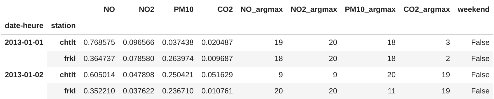

C'est ce jeu de donnée retravaillé que l'on va utiliser dans les deux parties suivantes.

#### &nbsp;&nbsp;&nbsp;&nbsp;&nbsp;&nbsp; **Approche non supervisée : k-means**

En effectuant un k-means sur des vecteurs tels qu'introduits précédemment, et en règlant le nombre de clusters sur 2, on obtient les résultats suivants :
- Le cluster contenant le plus faible nombre de points (à priori assimilables aux jours du weekend) contient 39,4% des points (le % de réels de jours du weekend dans le dataset est de 27.7%).
- La clusterisation correspond à la qualité jour ouvré / weekend dans 57.9% des cas.
- On obtient la matrice de confusion suivane :

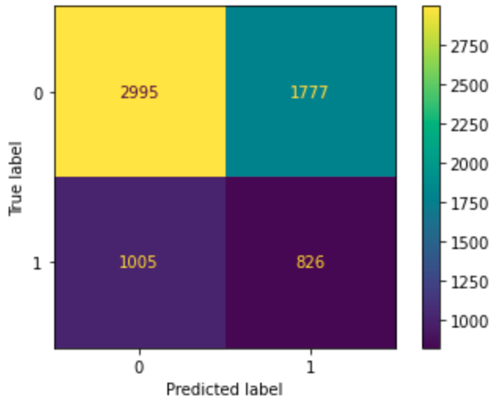

La capacité du kmeans à déterminé si des mesurs viennent d'un jour ouvré ou d'un jour du weekend est donc assez limitée. On pourrait tenter d'améliorer notre capacité de classification en adoptant un modèle supervisé.

#### &nbsp;&nbsp;&nbsp;&nbsp;&nbsp;&nbsp; **Approche supervisée : k-voisins**

On peut profiter de la connaissance de la date de chacun des relevés pour mettre en oeuvre un modèle d'apprentissage supervisé. On utilise le modèle des k-voisins.

On génère un jeu d'entrainement et un jeu de test contenant 33% des valeurs.  
On commence par déterminer le nombre de voisins optimal par validation croisée : on obtient la valeur 12.  
On entraîne ensuite le modèle sur l'ensemble des données d'entraînement avec ce paramètre k=12 optimal, puis on mesure les performances de prédictions du modèle sur le jeu de test. Les performances obtenues sont les suivantes :

- % de prédictions correctes : 84%
- f1-score : 68%
- matrice de confusion :

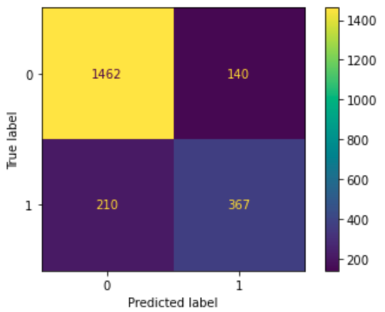

Lors des tests effectués, on a remarqué que les performances étaient meilleures si on standardisait le jeu de données au préalable. Les résultats ci-dessus ont donc été obtenus avec des variables explicatives standardisées. Les performances du modèles sont globalement correctes.  

Bien qu'il soit intéressant de remarquer que la qualité de l'air dans le métro a une "signature" en fonction du type de jour (semaine ou weekend), cette approche n'a que peu d'intérêt en pratique car on connait toujours la date du jour : une prédiction de ce type n'est donc pas vraiment utile en pratique.

### &nbsp;&nbsp;&nbsp; **3.5. Prédiction de la qualité de l'air de la station Franklin Roosevelt**

Au vu de la qualité du jeu de données (voir partie dédiée ci-dessus), ainsi que pour diminuer le travail de collecte de données complémentaires par la suite, on choisit de se limiter aux prédictions de qualité de l'air sur la station Franklin Roosevelt.

Le modèle développé ici se fixe pour objectif de prédire la valeur d'un paramètre de qualité de l'air en se basant uniquement sur l'année, le mois, le numéro du jour dans la semaine et l'heure.

#### &nbsp;&nbsp;&nbsp;&nbsp;&nbsp;&nbsp; **Construction du modèle**

On se focalise sur un unique paramètre à la fois, mais la démarche est reproductible quel que soit le paramètre. Les éléments qui suivent se basent sur le paramètre N02.

Format du jeu de données injecté dans le modèle :

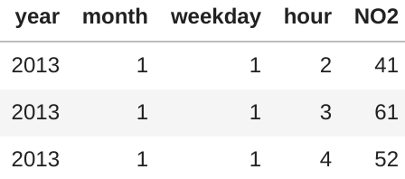

Les analyses préliminaires ont montré que l'évolution de la valeur des paramètres en fonction de l'heure du jour était strictement non linéaire. Nos connaissances en terme d'algorithme de régression non linéaire étant limitées, on utilise ici également l'algorithme des k-voisins, mais dans sa version régression et non classification.

Après division du jeu de donnés en un set d'entrainement et un set de test (33% des données), on détermine le k optimal à partir d'une cross validation sur le jeu d'entraînement. Le paramètre k optimal est 16.

Courbe d'erreur de cross-validation en fonction du paramètre k :

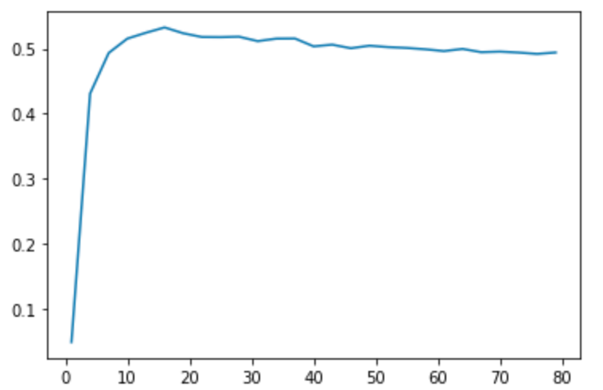

#### &nbsp;&nbsp;&nbsp;&nbsp;&nbsp;&nbsp; **Performances du modèle**

En prédiction sur le jeu de test, le modèle donne un coefficient de détermination R2 de 0.55. Les performances du modèle sont donc limitées.

Comparons les valeurs moyennes prédites par le modèle sur les différentes échelles de temps par rapport aux valeurs vraies :

On constate qu'en moyenne, le modèle semble plutôt bon. En revanche, si il présente un coefficient de détermination aussi faible, c'est qu'il n'est pas performant pour décrire les écarts de qualité de l'air d'un jour à l'autre, ce qui est normal car on n'a pas encore introduit de paramètres permettant par exemple de différencier deux lundis ou deux mardis.

### &nbsp;&nbsp;&nbsp; **3.6. Enrichissement du jeu de données par des sources complémentaires en vue d'améliorer les prédictions**

Jusqu'à présent, toutes les courbes de qualité de l'air présentées étaient des courbes moyennes obtenues à partir d'un grand nombre de valeur. Essayons maintenant de comparer l'évolution de la qualité de l'air au sein de la station Franklin Roosevelt sans moyenner les valeurs sur plusieurs jours. Par exemple, les courbes ci-dessous comparent les lundis 9 et 16 juin 2014.

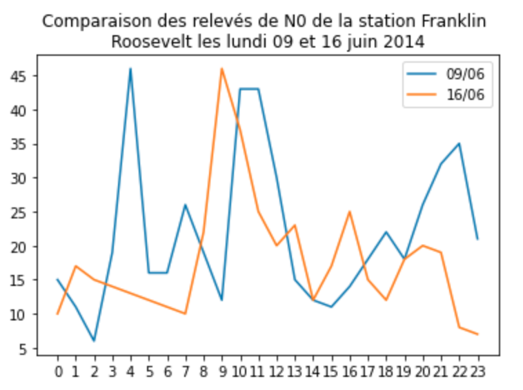

On constate des écarts de qualité de l'air significatifs sur certaines plages horaires : par exemple autour de 4h du matin le 9 juin 2014, la concentration en NO est de plus de 45 µg/m3, alors qu'elle est de moins de 15 µg/m3 le 16 juin à la même heure. On constate un écart également significatif en fin de journée (35 µg/m3 VS 20 µg/m3).

Or, dans le modèle introduit précédemment, rien ne permet justement de différencier ces deux jours : c'est donc pour cela que le modèle est limité en terme de performances. Cette analyse préliminaire met donc en évidence la nécessité d'introduire de nouvelles variables explicatives dans notre modèle, si l'on veut espérer effectuer des prédictions plus fines. On pourra également essayer d'autre modèles que les k-voisins.

<h1 id="ref4">4. Nettoyage des autres jeux de données</h1>

On souhaite étudier plus précisément l'influence des paramètres extérieurs (météo, qualié de l'air extérieur) et des données de fréquentation (affluence en station, trafic ferroviaire) sur la qualité de l'air dans la station. 
Le fichier **4_data_ext_cleaning.ipynb** présente le processus de chargement et nettoyage des données.

### &nbsp;&nbsp;&nbsp; **4.1. DataFrames générés**

Les données retravaillées sont contenues dans 5 DataFrames différents :  
<i><b>Qualité de l'air en station :</b></i>
<h5 align=left>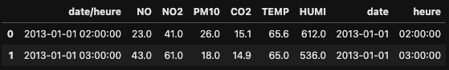</h5> 
<i><b>Historique météo :</b></i>
<h5 align=left>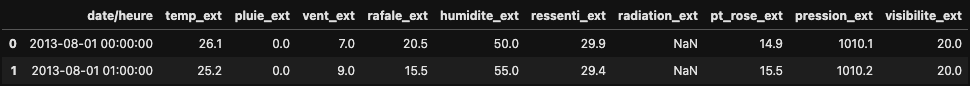</h5> 
<i><b>Qualité de l'air extérieur :</b></i>
<h5 align=left>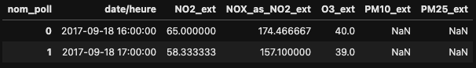</h5>
Les valeurs affichées représentent la moyenne des mesures effectuées sur 3 stations (Paris 2, Paris 4 et Paris 6) en µg/m3  
<i><b>Trafic ferroviaire :</b></i>
<h5 align=left>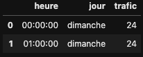</h5>
Nombre de passages de trains théoriques en station sur l'heure précédente (ex : le dimanche, 24 trains sont passés entre 00:00 et 01:00)  
<i><b>Affluence :</b></i>
<h5 align=left>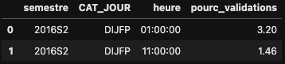</h5>
Taux de validation de la tranche horaire sur la journée-type (ex: les dimanches et jours fériés, pour la tranche horaire 10h30-16h30 (dont 11h fait partie), les validations représentent 1.46% du total de la journée-type)  

### &nbsp;&nbsp;&nbsp; **4.2. DataFrame global**

<i><b>DataFrame "calendrier" permettant la fusion des jeux de données précédents :</b></i>
<h5 align=left>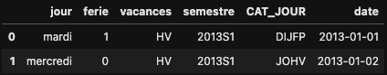</h5> 

<i><b>Infos du DataFrame global :</b></i>
<h5 align=left>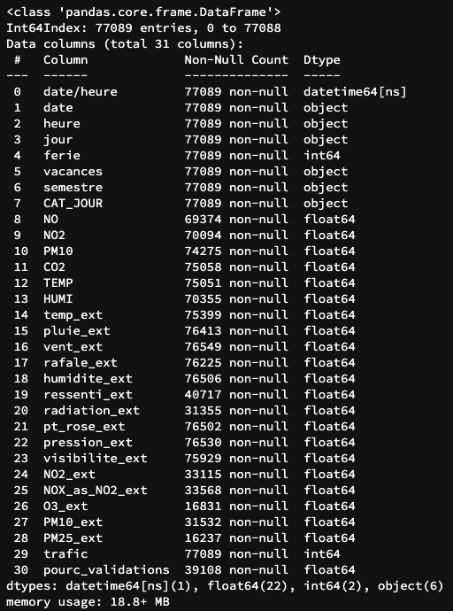</h5> 

Le DataFrame global une fois généré permet d'effectuer une analyse de corrélation.

<h1 id="ref5">5. Etudes de corrélations</h1>

xxx

<h1 id="ref6">6. Conclusion</h1>
